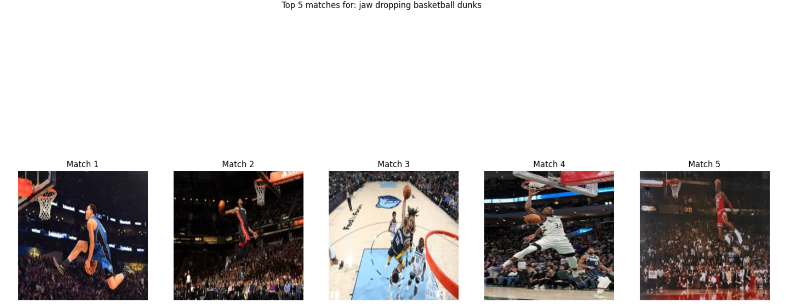

# Sample Visual/Multi-modal search using OCI OpenSearch and CLIP

In this sample we showcase how you can leverage the capabilities of OCI OpenSeach and the power of state-of-the-art multimodal model, **CLIP (Contrastive Language-Image Pretraining)** to build an end-to-end enterprise grade solution for multi-modal/visual search.

## Real-World Applications of Visual Search Leveraging OCI OpenSearch + CLIP 
The combination of OCI OpenSearch and CLIP is revolutionizing visual search across multiple industries:

- **E-Commerce**: Shoppers can search for products using natural language (e.g., “black leather boots with a chunky heel”) and instantly find relevant items without relying on manual tags.

- **Media and Entertainment**: Media archives can allow users to find specific scenes in videos or movies by describing them (e.g., “a futuristic city with neon lights at night”).

- **Healthcare**: Medical researchers can retrieve relevant X-rays or MRIs based on text-based descriptions of conditions.

- **Security and Surveillance**: Law enforcement can quickly locate specific individuals or objects within vast datasets of CCTV footage using descriptive queries.

### Example Queries and output
1. Below are some of the sample queries and output results on the Fashion Trends dataset. It is impoartant to note that the images were ingested without a single label or textual description. only the image embeddings are getting stored. 
The results below show that the Visual search is able to accurately understand the context and semantic of the input text query, and is able to find images that most visually match the textual query.
```python
search_image(index_name=PRODUCT_INDEX_NAME, dataset=fashion_trends_dataset, text_query="expensive blue diamon necklace",top_k=3, figSize=(20,10))

```


```python
search_image(index_name=PRODUCT_INDEX_NAME, dataset=fashion_trends_dataset, text_query="Man wearing a slick brown jacket with jeans and sun glasses",top_k=4, figSize=(20,10))

```


```python
search_image(index_name=PRODUCT_INDEX_NAME, dataset=fashion_trends_dataset, text_query="stunning red carpet posed with luxurious fashion style",top_k=3, figSize=(20,10))

```


```python
search_image(index_name=PRODUCT_INDEX_NAME, dataset=fashion_trends_dataset, text_query="jaw dropping basketball dunks",top_k=5, figSize=(20,10))
```



## What is in the code pipeline? 
The end-to-end Jupyter Notebook [visual-search-pipeline](./visual-search-with-opensearch/visual-search-pipeline.ipynb) is broken into the following flow:

- Load and preprocess datasets ([CIFAR-10](https://www.cs.toronto.edu/~kriz/cifar.html), [RANDOM FASHION TRENDS](./data/fashion_trends), or custom datasets).

- Extract image embeddings using CLIP.

- Index embeddings into OpenSearch for efficient retrieval.

- Perform real-time visual search using natural language queries.

- Visualize search results in a user-friendly format.


## How to use the code 
1. The [config.py](./config.py) file contains configurable parameters that you need to update with your cluster settings
```python
OPENSEARCH_USERNAME='<USER_NAME>'
OPENSEARCH_PASSWORD='<PWD>'
COMPARTMENT_ID = "<YOUR_COMPARTMEN_ID>"

# OpenSearch Connection Details
OPENSEARCH_HOST = "<YOUR_OPENSEARCH_HOST>" #e.g:  .......zl7dva.opensearch.us-ashburn-1.oci.oraclecloud.com
OPENSEARCH_URL="<YOUR_OPENSEARCH_URL>"
```
2. The code uses Resource principal authentication method to connect to the cluster and run within the OCI environment. If you want to run the code locally, you should change the **AUTH_TYPE** in config.py file to **BASIC**
```python
AUTH_TYPE="BASIC" 
```
3. Feel free to change the cluster settings

4. The [utils.py](./utils.py) file contains the **LocalImageDataset** calss which inherits from the **Dataset** class. This class is used to create a dataset object by loading  data from specified source which could be local or online such as publicly available dataset. 

5. There is a toy [FASHION TREND datasets](./data/fashion_trends/) available in the code that you can play with. it contains about 220 images split acrross 5 categories. Feel free to Augment the dataset or create your own custom dataset, or even just use public dataset such as CIFAR-10 or even STL-10 dataset or miniImageNet

6. Follow the [VISUAL SEARCH PIPELINE](./visual-search-pipeline.ipynb) step by step to create your index; load, transfrom, process and ingest the dataset into your cluster; and perform visual search


